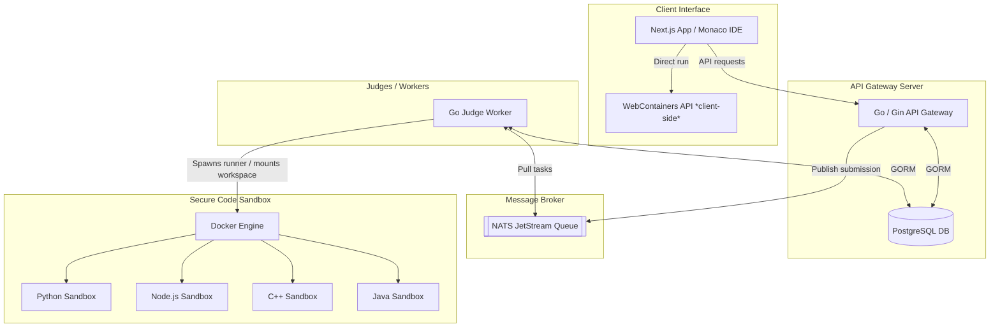

# CodeLab 🚀

A modern, full-stack, distributed online coding playground and judging platform. CodeLab allows users to write, execute, and submit code for a variety of algorithmic and frontend challenges. Submissions are processed asynchronously through a message queue and run in secure, sandboxed docker containers.

---

## 🏗️ Architecture Overview

CodeLab is designed with a decoupled, event-driven architecture to ensure high throughput, security, and responsiveness.



### Request & Judging Lifecycle

1. **Submission**: The user submits code from the Next.js Frontend via the API Gateway.
2. **Enqueue**: The API Gateway registers the submission in PostgreSQL and publishes a message to the **NATS JetStream** queue (`submissions.judge` subject).
3. **Pipelining**: A pool of concurrent **Judge Workers** pulls the submissions from NATS.
4. **Execution**: The worker mounts the source code into a temporary workspace, executes it inside a secure **Docker container** matching the language, and monitors execution bounds.
5. **Verdict Generation**: Output is verified against expected test cases. The database is updated, and the user receives the execution metrics (Verdict, memory used, runtime).

---

## ✨ Features

- **🚀 Isolated Code Sandbox**: Executes C++, Java, Node.js, and Python inside strict, resource-constrained Docker containers (limits memory, CPU, process limits, and output sizes).
- **⚡ Asynchronous Distributed Judging**: Decoupling code execution from web routing via NATS JetStream ensures the API server never hangs or slows down under load.
- **💻 Interactive Monaco-powered IDE**: Full-featured code editor with syntax highlighting, language toggles, sample test case runs, and real-time stderr/stdout visualization.
- **🌐 Browser-Based Frontend Sandboxing**: Integrates the **WebContainers API** to run Node.js/Vite projects directly in the user's browser, eliminating remote server overhead for frontend problems.
- **🛠️ Problem Management System**: Full admin endpoints for managing problems, bulk uploading topics/questions, and replacing hidden test suites.
- **📊 Detailed Execution Metrics**: Captures runtime in milliseconds, memory utilization in KB, and detailed compiler errors (CE) or runtime stack traces (RE).

---

## 🛠️ Technology Stack

| Component | Technology | Description |
| :--- | :--- | :--- |
| **Frontend** | **Next.js 16 (React 19)** | App Router, TypeScript, Tailwind CSS v4, Monaco Editor |
| **Backend** | **Go (Gin)** | High-performance routing, GORM, Zap logging, Docker SDK |
| **Queue** | **NATS JetStream** | Resilient queue and stream processing |
| **Database** | **PostgreSQL** | Transactional database for profiles, problems, and submissions |
| **Execution** | **Docker SDK** | Dynamic container creation and sandboxing |
| **Frontend Sandbox** | **WebContainers API** | Browser-based Node.js runtime |

---

## ⚙️ Environment Configuration

Both the frontend and backend require setup via environment variables.

### Backend Configurations (`backend/.env`)

Refer to [backend/.env.example](file:///D:/Projects/Personal/something/backend/.env.example) for the complete list of configurations:

- **Database Parameters**: Configure `DB_HOST`, `DB_PORT`, `DB_USER`, `DB_PASS`, and `DB_NAME`.
- **JWT Secrets**: Used for cookie-based session management (`JWT_SECRET`, `REFRESH_JWT_SECRET`).
- **NATS Connection**: Connect to the queue via `NATS_URL` (defaults to `nats://localhost:4222`).
- **Sandbox Constraints**:
  - `SANDBOX_RUN_TIMEOUT_MS`: Max execution time per test case (default: `2000ms`).
  - `SANDBOX_MEMORY_MB`: Memory restriction per container (default: `256`).
  - `SANDBOX_CPUS`: CPU quota allocation (default: `1`).
  - `SANDBOX_PIDS_LIMIT`: Prevent fork-bomb attacks by capping process IDs (default: `128`).

### Frontend Configurations (`frontend/.env.local`)

- `NEXT_PUBLIC_API_BASE_URL`: Pointer to the Go Gateway backend API (defaults to `http://localhost:8080/api`).

---

## 🚀 Getting Started

The root directory contains a `Makefile` configured to simplify local development operations.

### Prerequisites

Ensure you have the following installed locally:
- **Go** (v1.20 or later)
- **Bun** (for frontend package management)
- **Docker** & **Docker Compose**
- **Make** (command-line utility)

---

### Step-by-Step Setup

#### 1. Setup the Database and NATS Broker

Build the custom NATS JetStream image and spin up the queue container:

```bash
# Build the NATS docker image
make nats-build

# Start the NATS broker
make nats-up
```

*Note: Ensure you have a running PostgreSQL instance matching the credentials in `backend/.env`.*

---

#### 2. Build Sandbox Docker Images

Before executing submissions, build the isolated language runtimes:

```bash
make sandbox-images
```
This builds Docker images for:
- `codelab/sandbox-python:latest`
- `codelab/sandbox-node:latest`
- `codelab/sandbox-cpp:latest`
- `codelab/sandbox-java:latest`

---

#### 3. Seed the Database

Prepare the database tables and populate them with default topics and coding challenges:

```bash
make seed
```
*(Use `make seed-reset` to wipe tables and reseed).*

---

#### 4. Run the Development Services

Open separate terminal windows or run in the background:

```bash
# Start the Backend REST API (uses Air for hot-reloads)
make dev-server

# Start the Judge Worker (subscribes to NATS and processes submissions)
make dev-judge

# Start the Next.js Frontend
make dev-frontend
```

Now, navigate to `http://localhost:3000` to access the frontend workspace.

---

## 📂 Project Directory Structure

```text
something/
├── Dockerfile.nats          # Dockerfile for running NATS with JetStream
├── Makefile                 # Make shortcuts for server, frontend, docker commands
├── backend/
│   ├── cmd/
│   │   ├── main.go          # API gateway entrypoint
│   │   ├── judge/           # Judge worker CLI
│   │   └── seed/            # Seeding data binary
│   ├── config/              # Configuration loaders
│   └── internal/            # Core backend logic
│       ├── controllers/     # HTTP route handlers
│       ├── models/          # GORM schemas (Problem, Submission, User)
│       ├── queue/           # NATS client wrapper
│       ├── routes/          # API Route registrations
│       ├── sandbox/         # Docker client and execution controller
│       └── worker/          # Judge queue subscriber & message handler
└── frontend/
    ├── app/                 # Next.js Pages (dashboard, problems, profiles, auth)
    ├── components/          # Reusable React components (Monaco Editor, WebContainer)
    └── lib/                 # Core API request utilities & hooks
```

---

## 🚦 Judgement Verdicts Reference

When code is run, one of the following verdicts is returned:

- **`AC` (Accepted)**: The program executed correctly and matched the expected test outputs.
- **`WA` (Wrong Answer)**: The output did not match the expected answer for one or more test cases.
- **`TLE` (Time Limit Exceeded)**: The program exceeded the time limit (defined by `SANDBOX_RUN_TIMEOUT_MS`).
- **`MLE` (Memory Limit Exceeded)**: The program used more RAM than allowed (defined by `SANDBOX_MEMORY_MB`).
- **`CE` (Compilation Error)**: The compiler failed to build the program (e.g., C++/Java syntax errors).
- **`RE` (Runtime Error)**: The program crashed during execution (non-zero exit code or stderr output).
- **`IE` (Internal Error)**: An unexpected error occurred within the judge sandbox or supervisor container.
