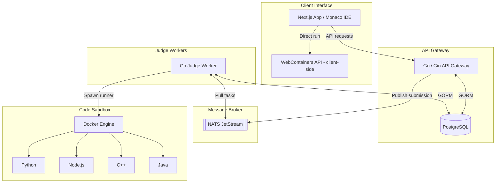

# CodeLab

A distributed online coding playground and judging platform. Write and submit code for algorithmic and frontend challenges — submissions are processed asynchronously through a message queue and executed inside secure, resource-constrained Docker containers.

<p align="center">
  
</p>

---

## Architecture

CodeLab uses a decoupled, event-driven design to keep the API server responsive under load while handling potentially long-running code execution in the background.



### Submission lifecycle

1. **Submit** — the user submits code from the frontend to the API gateway.
2. **Enqueue** — the gateway registers the submission in PostgreSQL and publishes a message to the NATS JetStream queue (`submissions.judge`).
3. **Pull** — a pool of concurrent judge workers subscribes to NATS and pulls submissions.
4. **Execute** — the worker mounts source code into a temporary workspace and runs it inside a sandboxed Docker container matching the target language, with enforced resource limits.
5. **Verdict** — output is compared against expected test cases. The database is updated and the user receives a verdict along with runtime and memory metrics.

---

## Features

- **Isolated code sandbox.** Executes C++, Java, Node.js, and Python inside Docker containers with strict limits on memory, CPU, process count, and output size.
- **Asynchronous distributed judging.** Submission handling is decoupled from web routing via NATS JetStream — the API server stays responsive regardless of queue depth.
- **Monaco-powered editor.** Full-featured in-browser IDE with syntax highlighting, language switching, sample test case execution, and real-time stdout/stderr output.
- **Browser-based frontend sandboxing.** Uses the WebContainers API to run Node.js/Vite projects directly in the browser, removing remote server overhead for frontend challenges.
- **Problem management.** Admin endpoints for creating and updating problems, bulk uploading topics, and replacing hidden test suites.
- **Detailed execution metrics.** Reports runtime in milliseconds, memory usage in KB, and full compiler error or runtime stack trace output.

---

## Technology Stack

| Component | Technology |
| :--- | :--- |
| Frontend | Next.js 16 (React 19), TypeScript, Tailwind CSS v4, Monaco Editor |
| Backend | Go (Gin), GORM, Zap logging, Docker SDK |
| Message broker | NATS JetStream |
| Database | PostgreSQL |
| Code sandbox | Docker |
| Frontend sandbox | WebContainers API |

---

## Configuration

### Backend (`backend/.env`)

See `backend/.env.example` for the full list. Key variables:

- `DB_HOST`, `DB_PORT`, `DB_USER`, `DB_PASS`, `DB_NAME` — PostgreSQL connection parameters
- `JWT_SECRET`, `REFRESH_JWT_SECRET` — secrets for cookie-based session management
- `NATS_URL` — NATS connection string (default: `nats://localhost:4222`)
- `SANDBOX_RUN_TIMEOUT_MS` — maximum execution time per test case (default: `2000`)
- `SANDBOX_MEMORY_MB` — memory limit per container (default: `256`)
- `SANDBOX_CPUS` — CPU quota per container (default: `1`)
- `SANDBOX_PIDS_LIMIT` — process ID cap to prevent fork-bomb attacks (default: `128`)

### Frontend (`frontend/.env.local`)

- `NEXT_PUBLIC_API_BASE_URL` — URL of the Go gateway API (default: `http://localhost:8080/api`)

---

## Getting Started

### Prerequisites

- Go v1.20 or later
- Bun
- Docker and Docker Compose
- Make

---

### Setup

#### 1. Start the database and message broker

Build the custom NATS image and start the broker:

```bash
make nats-build
make nats-up
```

Make sure a PostgreSQL instance is running with credentials matching `backend/.env`.

#### 2. Build sandbox images

Build the isolated language runtime containers before running any submissions:

```bash
make sandbox-images
```

This creates the following images:

- `codelab/sandbox-python:latest`
- `codelab/sandbox-node:latest`
- `codelab/sandbox-cpp:latest`
- `codelab/sandbox-java:latest`

#### 3. Seed the database

Create tables and populate them with default topics and challenges:

```bash
make seed
```

To wipe and reseed from scratch: `make seed-reset`

#### 4. Start development services

```bash
make dev-server    # API gateway with hot reload via Air
make dev-judge     # Judge worker, subscribes to NATS
make dev-frontend  # Next.js frontend
```

Then open `http://localhost:3000`.

---

## Project Structure

```text
codelab/
├── Dockerfile.nats              # NATS image with JetStream enabled
├── Makefile                     # Dev, build, and Docker shortcuts
├── backend/
│   ├── cmd/
│   │   ├── main.go              # API gateway entrypoint
│   │   ├── judge/               # Judge worker entrypoint
│   │   └── seed/                # Database seeding binary
│   ├── config/                  # Configuration loaders
│   └── internal/
│       ├── controllers/         # HTTP route handlers
│       ├── models/              # GORM schemas (Problem, Submission, User)
│       ├── queue/               # NATS client wrapper
│       ├── routes/              # Route registration
│       ├── sandbox/             # Docker client and execution logic
│       └── worker/              # NATS subscriber and message handler
└── frontend/
    ├── app/                     # Pages (dashboard, problems, profiles, auth)
    ├── components/              # Shared components (Monaco Editor, WebContainer)
    └── lib/                     # API utilities and hooks
```

---

## Verdicts

| Verdict | Meaning |
| :--- | :--- |
| `AC` — Accepted | Output matched all expected test cases |
| `WA` — Wrong Answer | Output did not match one or more test cases |
| `TLE` — Time Limit Exceeded | Execution exceeded `SANDBOX_RUN_TIMEOUT_MS` |
| `MLE` — Memory Limit Exceeded | Memory usage exceeded `SANDBOX_MEMORY_MB` |
| `CE` — Compilation Error | Compiler failed to build the program |
| `RE` — Runtime Error | Program crashed or exited with a non-zero code |
| `IE` — Internal Error | Unexpected failure in the sandbox or supervisor |

---

## Contributing

Contributions are welcome. Open an issue before submitting a large pull request.

---

## License

[MIT](LICENSE)
